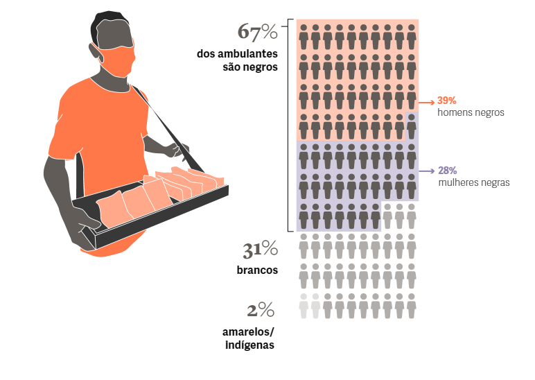
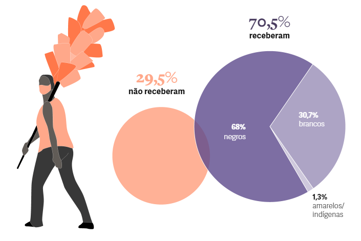

[](https://projeto-final-amaral.herokuapp.com/)      


## Alô Camelô


   
  
A API "Alô Camelô" é uma aplicação móvel mínima, limpa e bonita para ajudar as pessoas a encontrar  vendedores de rua, vendedores ambulantes, trabalhadores autônomos próximos , criando uma rede de apoio e ajudando a divulgação de seus serviços e produtos.


Status: **concluído** :heavy_check_mark:

## **Sumário**

* [Apresentação](#-Apresentação)
* [Contextualização](#-Contextualização)
* [Fonte dos dados](#-Fonte-dos-dados)
* [Funcionalidades](#-Funcionalidades)
* [Tecnologias Utilizadas](#-Tecnologias-utilizadas)
* [Instruções de Uso](Instruções-de-Uso)
* [Features e rotas](Feature-e-rotas)


## **Apresentação**

O "Alô Camelô" é o projeto de conclusão do bootcamp de Back-end da [{reprograma}](https://reprograma.com.br/). Essa é uma API que tem por objetivo ajudar aos vendedores de rua, ambulantes e autônomos.
A ideia é que ela possa ser aproveitada por um programa de rede de apoio para expandir o alcançe do trabalho de vários vendedores de rua. 

## **Contextualização**
 
No final de 2019, a Pesquisa Nacional por Amostra de Domicílio Contínua (PNAD Contínua), divulgada pelo Instituto Brasileiro de Geografia e Estatística (IBGE), mostrou que o Brasil atingiu nível recorde de trabalhadores informais: são 38,7 milhões de pessoas trabalhando por conta própria. As vendedoras e os vendedores ambulantes criam seus próprios postos de trabalho, contribuem para o crescimento econômico de suas regiões e fornecem um importante serviço de distribuição de mercadorias, fazendo-as chegar aos mais diversos públicos e realidades. Usando a própria força de trabalho, essa parcela trabalhadora do nosso país, ajuda a reduzir a pobreza e faz parte de nossa cultura e tradição e precisa ser arduamente protegida.

**Maioria dos ambulantes depende de auxílio financeiro para sobreviver durante a pandemia**


</img>

**AMBULANTES QUE RECEBERAM AUXÍLIO
RELACIONADO À COVID-19**

</img>

**FontePNAD/IBGE**

## **Funcionalidades**

* Login de pessoa administradora da API (cadastro, atualização e remoção de administradores)
* Cadastro de Locais 
* Lista de todos os locais 
* Atualização de cadastro de locais
* Remoção de locais

## **Tecnologias Utilizadas**

**Para construção da API**

* Node.js, versão 2.0.12;
* Gerenciador de pacotes node npm, versão 6.14.14;
* As dependências node:
     * Express versão 4.17.1;
     * Mongoose versão 6.0.4;
     * Dotenv-safe 10.0.0;
     * Bcrypt 5.0.1;
* Banco de dados NoSQL MongoDB;
* Editor de códigos VSCode.

## **Instruções de Uso**

**Pré-requisitos**


- Tenha instalado os programas ```Node.js``` e  ```MongoDB```, e o editor de códigos;
- Clone este repositório git clone <https://github.com/https://github.com/silvanaamaral/Projeto-final-Reprograma>;
- Dentro da pasta do projeto digite ```npm install``` no cmd para baixar as dependências do projeto;
- Renomeie o arquivo ```.env.exemple``` para ```.env``` e insira as variáveis de ambiente pedidas;
- Execute a aplicação em modo de desenvolvimento ```npm start```
- O servidor inciará na ```porta:3000 - acesse <http://localhost:3000>;```


**Teste da API**

- Abra o aplicativo [POSTMAN](#-POSTMAN) e use o endereço https://projeto-final-amaral.herokuapp.com/ como URL para testar as features e rotas.

## **Features e rotas**

#### _Rotas de Usuários_

| **Feature**                                | **Método** | **Rotas**|
|--------------------------------------------|------------|----------|
|Cadastro de locais                          | POST       |  /local/create        |
|Lista de todos os locais                    |GET         | /local/todos |
|Lista local específico                    | GET | /local/:id |
|Filtra locais por nome                   | GET        | /local/nome        |
|Atualização de cadastro dos locais          | PUT        | /local/atualiza/:id          |
|Remoção de locais                           | DELETE     |   local/deleta/:id       |

#### _Rotas de Administrador (Usar token de autenticação)_

|**Feature**                                 |**Método** | **Rotas**    |
|--------------------------------------------|-----------|------------- |           
|  Login do Administrador                    |  POST     | /admin       |       
|  cadastro do Administrador                 |  POST     | /create      |  
|  Lista dos Administradores                 |  GET      | /todos       | 
|  Atualização de Administrador por id       |  PUT      | /admin/:id   |
|  Remoção de Administrador por id        | DELETE    | /admin/:id |

## **Expressão de Gratidão** 🙌

" O que sabemos é uma gota, o que ignoramos é um Oceano".(Isaac Newton)
A evolução deste projeto contou com ajuda de diversas pessoas , as colegas de turma, professores, monitoras, agradeço imensamente. O carinho e a dedicação se tornaram ferramentas que me permitiram, chegar até o final deste ciclo de forma satisfatória. 
Meu muito Obrigada ❤️ !

[](https://www.linkedin.com/in/silvanaamaralpe/) []()


